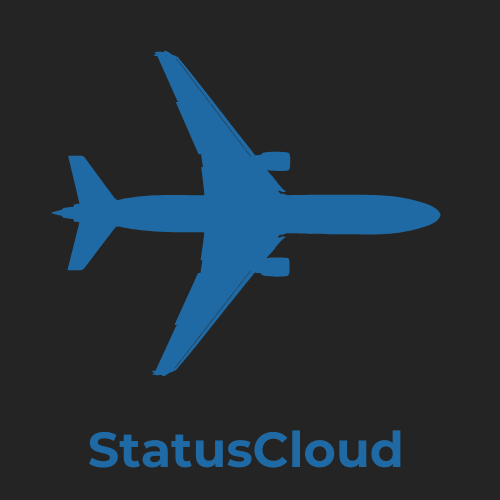
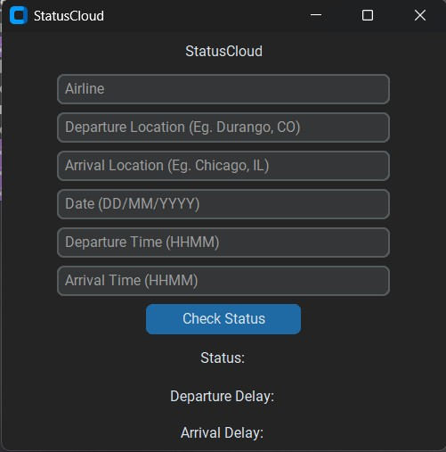

<br>
## StatusCloud - Flight Delay Predictor App

StatusCloud is a flight delay prediction application built with **CustomTkinter**, **NumPy**, and **Pandas**. The app predicts potential flight delays based on user-provided flight details, providing a smooth and interactive experience.



## Features

- Enter flight details such as departure time, arrival time, and airline.
- Predicts flight delay based on the entered data.
- Modern, user-friendly interface built with **CustomTkinter**.
- Uses **NumPy** for mathematical computations and **Pandas** for data handling.

## Installation

1. Clone the repository:
   ```bash
   git clone https://github.com/adharvarunk/statuscloud.git
   cd statuscloud

2. Install the necessary dependencies:
    ```bash
   pip install -r customtkinter numpy Pandas

3. Run the application
    ```bash
    python gui.py